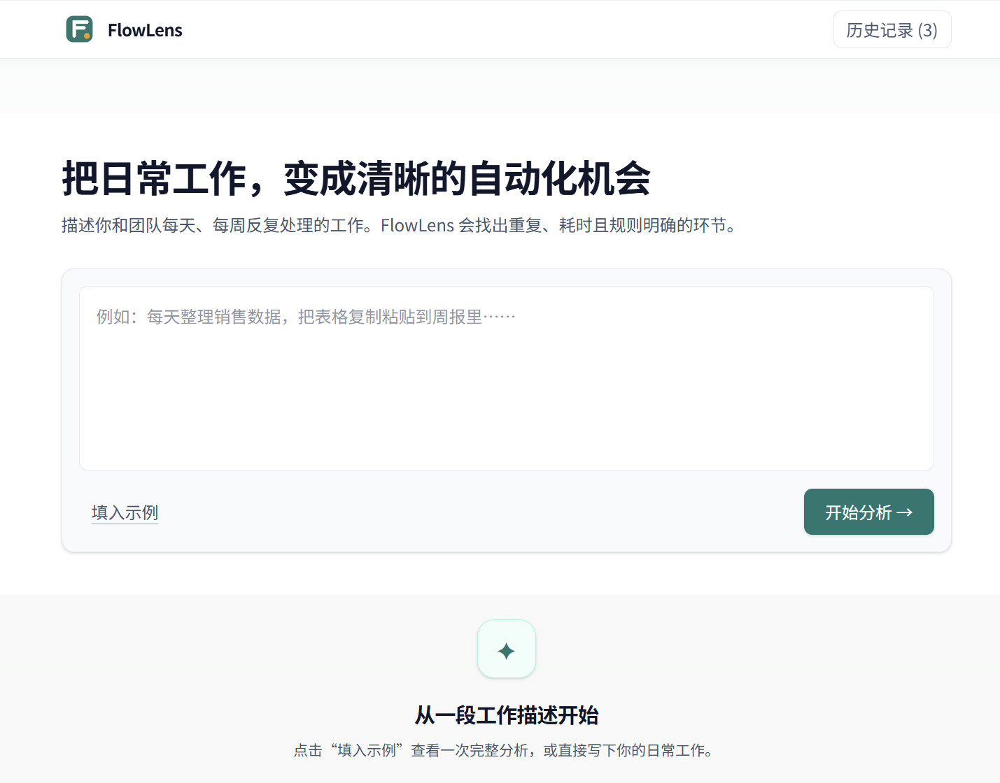
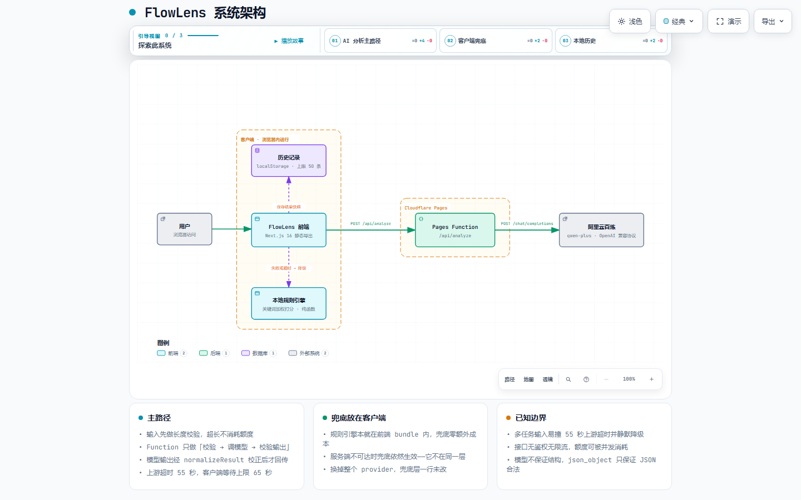

# FlowLens

[](https://flowlens-3jx.pages.dev)
[](./LICENSE)
[](https://nextjs.org)
[](https://react.dev)
[](https://www.typescriptlang.org)
[](https://tailwindcss.com)
[](https://pages.cloudflare.com)

FlowLens is a lightweight AI workflow analysis tool. Paste a description of your day-to-day work, and it identifies the tasks that are **repetitive, time-consuming, and rule-driven** — the best candidates for automation — then turns that vague feeling into an actionable plan.

For each automatable task, FlowLens outputs:

- **Priority score** (0–100) weighted across three dimensions (repetition / time cost / rule clarity)
- **Judgement rationale** — why this task was flagged as automatable
- **Automation suggestions**
- **SOP** (trigger / inputs / steps / output)
- **Reusable prompt** you can copy into an AI assistant



## How it works

1. Enter a short description of your daily work (or click **填入示例** / "Load example").
2. Click **开始分析** / "Analyze".
3. The text is sent to a server-side function, which asks a Qwen model (via Alibaba Cloud Model Studio's OpenAI-compatible API) to segment the description, score each task, and write up the suggestions, SOP and prompt as structured JSON.
4. **If the model path is unavailable for any reason** — network error, timeout, malformed output, or exhausted free quota — FlowLens automatically falls back to a **local rule-based engine** bundled into the page itself, and labels the result as such. Analysis never fails outright.
5. Every completed analysis is saved to your browser's local storage so you can revisit it later.

The two paths are labelled in the UI: **AI 分析** (model) vs **本地规则分析** (fallback).

## Architecture



The two dashed branches are the parts that matter. Completed analyses are snapshotted into `localStorage`, and any failure on the model path degrades to the rule engine — which is bundled into the page itself, so it keeps working even when the server is entirely unreachable.

*Diagram source: [`docs/diagrams/flowlens-architecture.json`](docs/diagrams/flowlens-architecture.json). Labels are in Chinese, matching the app's UI.*

## Tech stack

- **Next.js 16** (App Router, static export)
- **React 19**
- **TypeScript** (strict)
- **Tailwind CSS v4**
- **Cloudflare Pages Functions** + **Alibaba Cloud Model Studio (百炼 / DashScope)**, called through its OpenAI-compatible API

No API key is stored in this repository. The key lives in a server-side environment variable (Cloudflare project settings in production, `.dev.vars` locally — both outside version control). The browser never sees it and never calls the model service directly.

## Running locally

```bash
npm install

# Frontend only. The serverless function is absent, so analysis
# automatically falls back to the local rules engine.
npm run dev
# open http://localhost:3000
```

To exercise the **real model path** locally, copy the environment template and add your key:

```bash
cp .dev.vars.example .dev.vars   # then edit it and set OPENAI_API_KEY
npm run dev:full                 # builds, then serves static assets + the Pages Function
```

`.dev.vars` is git-ignored, so your key never enters the repository.

FlowLens speaks the OpenAI protocol, so you can point it at any compatible service by overriding these in `.dev.vars`:

| Variable | Default |
|---|---|
| `OPENAI_API_KEY` | *(required — no default)* |
| `OPENAI_BASE_URL` | `https://dashscope.aliyuncs.com/compatible-mode/v1` |
| `OPENAI_MODEL` | `qwen-plus-2025-07-28` |

Other scripts:

```bash
npm run smoke       # smoke tests: engine, output validation, fallback, history
npm run snapshot    # render every component to static HTML (for diffing)
npm run typecheck   # type-checks both the app and the serverless function
npm run build       # production build → out/
npm run start       # serve the built out/ locally
```

> `npm run start` serves the static `out/` directory — `next start` is not applicable here because the project uses `output: "export"`. Like `npm run dev`, it has no serverless function, so analysis falls back to the local rules engine.

## Deploying

Deployed as a **Cloudflare Pages** project:

- Build command: `npm run build`
- Output directory: `out`
- **Required**: set an `OPENAI_API_KEY` environment variable under *Settings → Environment variables* (optionally `OPENAI_BASE_URL` and `OPENAI_MODEL` too). Without the key the deployed site still works, but every analysis silently takes the fallback path.

## Known limitations

- **Requires your own API key and quota.** The model path calls Alibaba Cloud Model Studio and consumes your account's quota. If the key is missing, invalid, or the quota is exhausted, requests fail and FlowLens falls back to the rule engine — without telling you which of those three it was.
- **Non-deterministic.** On the model path, the same input can produce different output across runs. (The rule-based fallback *is* deterministic — the same input always yields the same result.)
- **Structured output is enforced defensively, not guaranteed.** The model service only supports `response_format: {"type": "json_object"}`, which guarantees **valid JSON syntax but not any particular structure**. The expected shape is described in the prompt, and every response is validated and repaired server-side; anything unusable triggers the fallback rather than reaching the page.
- **Tuned for one model.** The prompt was written for `qwen-plus`. Switching `OPENAI_MODEL` to a much weaker model will lower the JSON compliance rate and push more requests onto the fallback path.
- **The fallback engine is still keyword-based.** When degraded, the original limitations apply: it matches keywords by substring, so it can miss tasks that are paraphrased and can flag a segment purely because it happens to contain a trigger word.
- **Heuristic scoring.** Priority scores and the "hours saved per week" estimate are rough estimates — from the model or from the rule engine — not measurements. The time-saving figure additionally assumes that automation removes **about 50%** of the work (the rest goes to reviewing results, handling exceptions and maintaining the rules); it is a stated assumption, not a measured value.
- **History is local only.** Analysis history lives in your browser's `localStorage`. It does not sync across devices or browsers, clearing site data erases it, and it is unavailable in private/incognito windows. Only the most recent **50** entries are kept.
- **No persistence beyond that.** No backend database, no accounts, no authentication.
- **Single page, Chinese-only UI.** No routing, no internationalisation, no dark mode, no file upload.

## License

MIT — see [LICENSE](./LICENSE).
